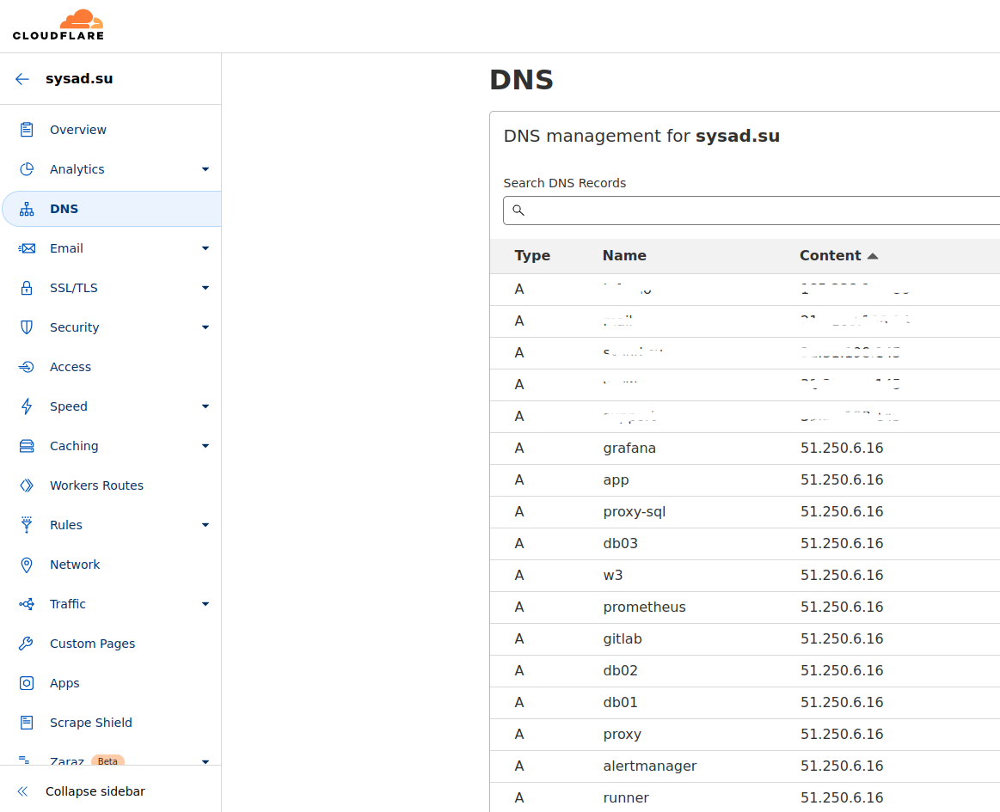
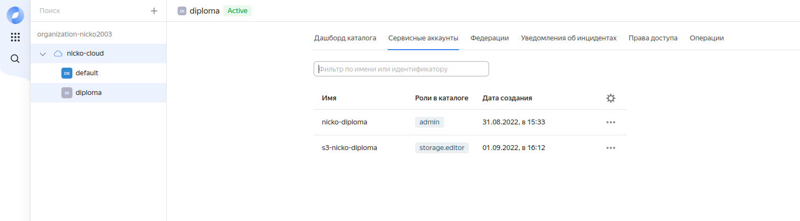
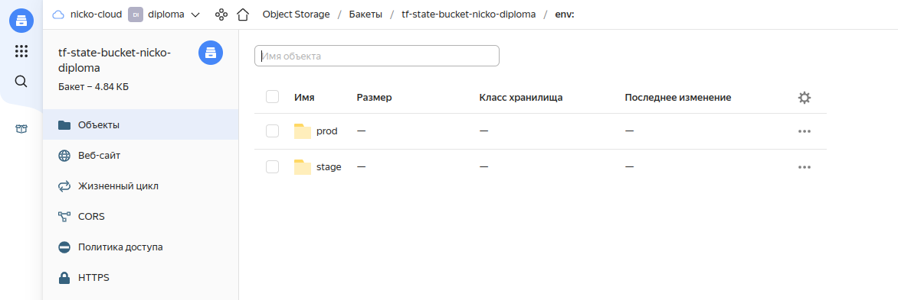
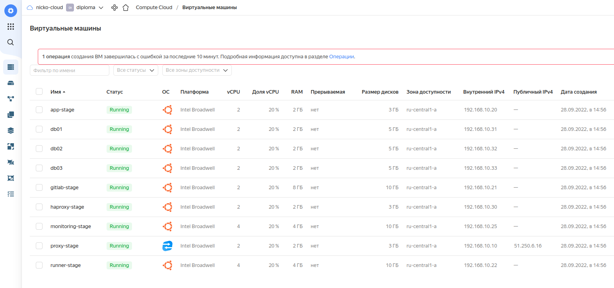

# Дипломное проект по курсу «DevOps-инженер»


## 1. Регистрация доменного имени.

У регистратора [REG.RU](https://www.reg.ru/) зарегистрированно доменное имя `sysad.su`.  

Используются NSы cloudflare.com.:  




## 2. Создание инфраструктуры.  

- Существует облако `nicko-cloud ( id = b1gusbu5rl5peuirh6d4 ) `

- В Yandex Cloud WebUI cоздаю каталог для диплома `diploma ( id = b1g9722vka0pph7vu29a )` и сервисный аккаунт `nicko-diploma ( id = ajeitrutkofhd0mjlhhl )`  




Резервирую в Yandex Cloud один статический "белый" IP-адрес `51.250.6.16`.  
Данный адрес будет настроен на "бастионе" (прокси) для доступа к внутренним узлам проекта и для возможности прописать ДНС-записи.  

В terraform создаю два workspace: stage и prod. Параметры каждой виртуальной машины (количество ядер, размер ОЗУ, размер диска) настраиваются программно исходя из значений в `nodes_parameters.tf`.  

Состояние terraform сохраняю в YC S3 бакет:  




Инфраструктура создаётся командами:  
```
export YC_TOKEN="AQAAAAAA..."

cd ./diploma_netology
terraform apply -auto-approve
```
В результате получаю набор ВМ, необходимых для выполнения заданий дипломного проекта:  



## 3. Установка Nginx и LetsEncrypt.

Для создания узла-бастиона использую образ YC `nat-instance-ubuntu-1804-lts` - это упрощает настройку доступа внутренних ВМ в глобальную сеть.  

Для установки Nginx и LetsEncrypt на узел-бастион создана ansible-роль `nginx`.  
Данная роль выполняет следующие функции:  
- устанавливает на хост `nginx`, `certbot` (LetsEncrypt);
- конфигурирует nginx в качестве реверс-прокси ( настраивает upstream для доменов проекта );
- получает сертификаты LetsEncrypt для доменов проекта.

Через узел-бастион настроен проброс ssh-трафика для доступа к внутренним узлам проекта ( использую директиву PREROUTING файрвола ufw ).  
Данный функционал реализован через роль `proxy-firewall`.  


## 4. Установка кластера MySQL.

### 4.1
Архитектура кластера MySQL в режиме Master-Slave обладает рядом существенных недостатков.  
Поэтому мне показалось интересным содать полнофункциональный кластер MySQL с репликацией и балансировкой нагрузки.  
В качестве решения выбран [Galera Claster](https://galeracluster.com/products/).  
Преимущества данной архитектуры:  
- решение высокой доступности с синхронной репликацией, отработкой отказа и повторной синхронизацией;
- отсутствует риск потери данных;
- актуальные данные на всех серверах, без отставания части узлов(отсутствие задержки ведомого);
- не требуются операции обхода отказа Master;
- нет необходимости вручную создавать резервную копию базы данных и копировать ее на новый узел.  

Для развёртывания `Galera Claster` требуется минимум три хоста, для этого созданы хосты с именами `db01.sysad.su`, `db02.sysad.su`, `db03.sysad.su`.  
Для установки и настройки кластера создана роль `mysql_galera_cluster_install`.

В качестве балансировщика нагрузки используется `HAProxy`, устанавливается и настраивается для работы с кластером MySQL ролью `haproxy_install`.  

### 4.2
База данных `wordpress` создаётся ролью `mysql_create_db`.  
### 4.3
Создание пользователя `wordpress` и назначение прав производится ролью  `mysql_create_user`.  

## 5. Установка WordPress.

Для установки CMS Wordpress на хост `app.sysad.su` используется несколько ролей:
- `php` - устанавливает PHP с расширениями;
- `apache` - устанавливает apache;
- `wordpress`. Данная роль разворачивает готовый сайт и производит загрузку БД сайта в кластер MySQL.

Результат работы:  


Структурная схема веб-узла проекта выглядит следующим образом:  
 


