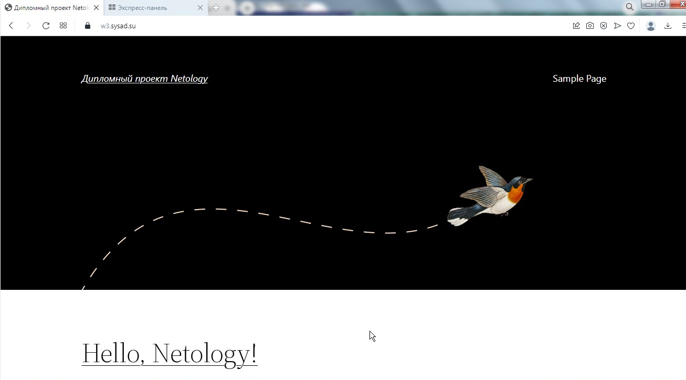
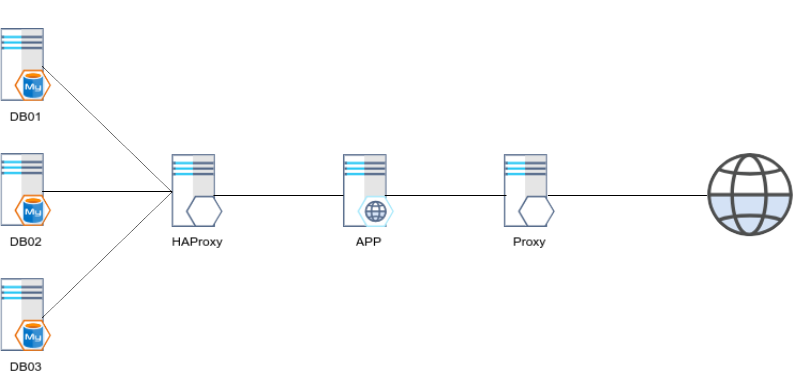
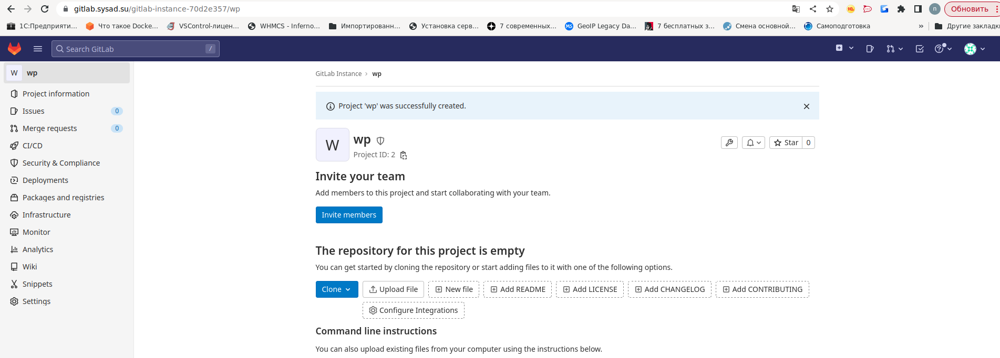
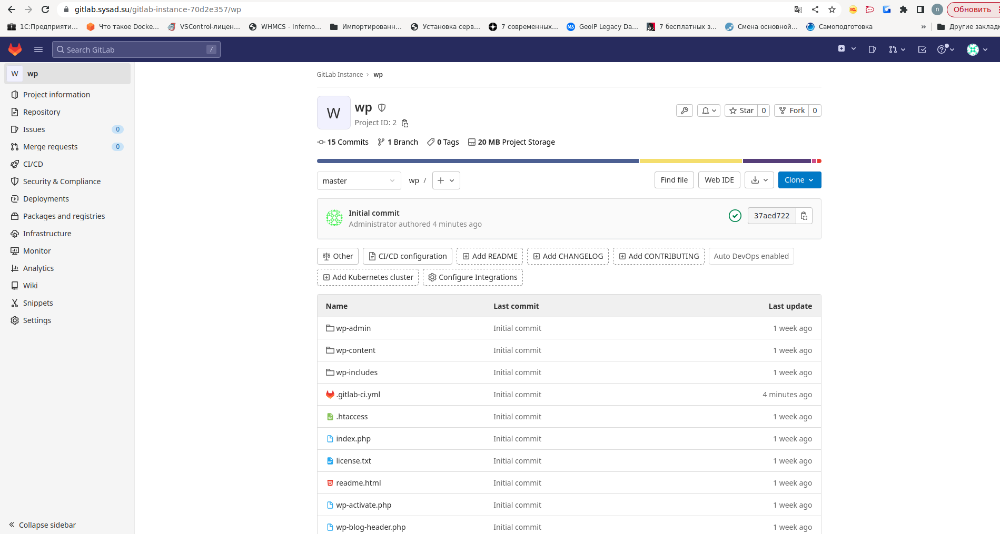
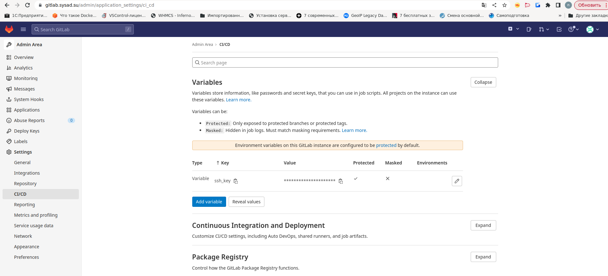
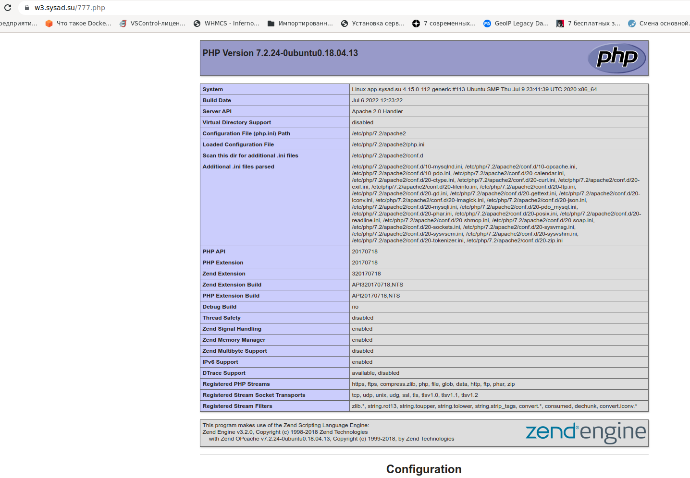
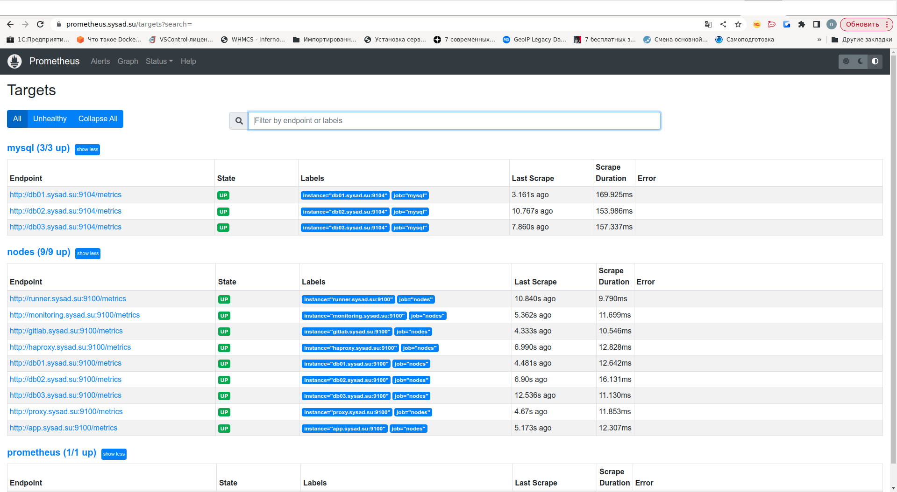
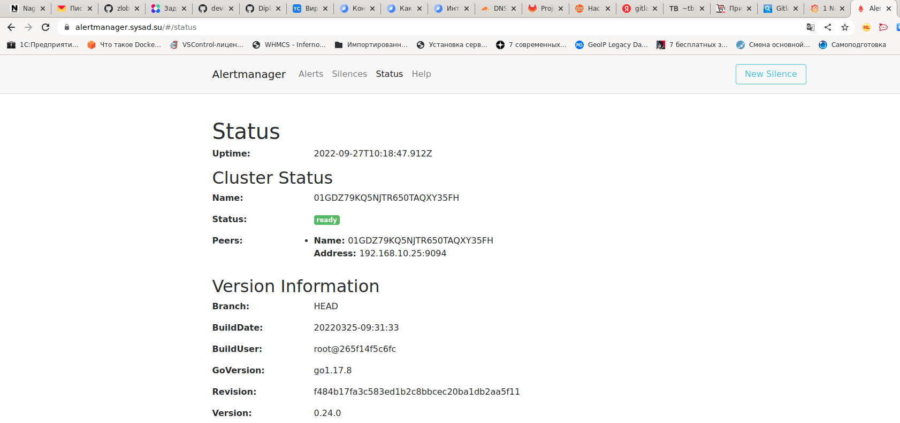
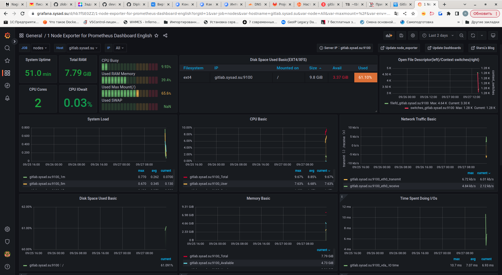

# Дипломное проект по курсу «DevOps-инженер»


## 1. Регистрация доменного имени.

У регистратора [REG.RU](https://www.reg.ru/) зарегистрированно доменное имя `sysad.su`.  

Используются NSы cloudflare.com.:  


## 2. Создание инфраструктуры.  

- Существует облако `nicko-cloud ( id = b1gusbu5rl5peuirh6d4 ) `

- В Yandex Cloud WebUI cоздаю каталог для диплома `diploma ( id = b1g9722vka0pph7vu29a )` и сервисный аккаунт `nicko-diploma ( id = ajeitrutkofhd0mjlhhl )`  


Резервирую в Yandex Cloud один статический "белый" IP-адрес `51.250.6.16`.  
Данный адрес будет настроен на "бастионе" (прокси) для доступа к внутренним узлам проекта и для возможности прописать ДНС-записи.  

В terraform создаю два workspace: stage и prod. Параметры каждой виртуальной машины (количество ядер, размер ОЗУ, размер диска) настраиваются программно исходя из значений в `nodes_parameters.tf`.  

Состояние terraform сохраняю в YC S3 бакет:  


Инфраструктура создаётся командами:  
```
export YC_TOKEN="AQAAAAAA..."

cd ./diploma_netology
terraform apply -auto-approve
```
В результате получаю набор ВМ, необходимых для выполнения заданий дипломного проекта:  


## 3. Установка Nginx и LetsEncrypt.

Для создания узла-бастиона использую образ YC `nat-instance-ubuntu-1804-lts` - это упрощает настройку доступа внутренних ВМ в глобальную сеть.  

Для установки Nginx и LetsEncrypt на узел-бастион создана ansible-роль `nginx`.  
Данная роль выполняет следующие функции:  
- устанавливает на хост `nginx`, `certbot` (LetsEncrypt);
- создаёт в `nginx` конфиг-файлы виртуальных хостов для доменов проекта `w3.sysad.su`, `gitlab.sysad.su`, `grafana.sysad.su`, `prometheus.sysad.su`, `alertmanager.sysad.su`;
- конфигурирует nginx в качестве реверс-прокси ( настраивает upstream для доменов проекта );
- получает сертификаты LetsEncrypt для доменов проекта.

Через узел-бастион настроен проброс ssh-трафика для доступа к внутренним узлам проекта ( использую директиву PREROUTING файрвола ufw ).  
Данный функционал реализован через роль `proxy-firewall`.  


## 4. Установка кластера MySQL.

### 4.1
Архитектура кластера MySQL в режиме Master-Slave обладает рядом существенных недостатков.  
Поэтому мне показалось интересным создать полнофункциональный кластер MySQL с репликацией и балансировкой нагрузки.  
В качестве решения выбран [Galera Claster](https://galeracluster.com/products/).  
Преимущества данной архитектуры:  
- решение высокой доступности с синхронной репликацией, отработкой отказа и повторной синхронизацией;
- актуальные данные на всех серверах, без отставания части узлов(отсутствие задержки ведомого);
- не требуются операции обработки отказа сервера Master;
- нет необходимости вручную создавать резервную копию базы данных и копировать ее на новый узел;  
- прозрачность для приложений - не требует никаких изменений в приложении;
- не требуется разделение на чтение и запись.

Для развёртывания `Galera Claster` требуется минимум три хоста, для этого созданы хосты с именами `db01.sysad.su`, `db02.sysad.su`, `db03.sysad.su`.  
Установка и настройка кластера выполняется ролью `mysql_galera_cluster_install`.

В качестве балансировщика нагрузки используется `HAProxy`, устанавливается и настраивается для работы с кластером MySQL ролью `haproxy_install`.  

### 4.2
База данных `wordpress` создаётся ролью `mysql_create_db`.  
### 4.3
Создание пользователя `wordpress` и назначение прав производится ролью  `mysql_create_user`.  

## 5. Установка WordPress.

Для установки CMS Wordpress на хост `app.sysad.su` используется несколько ролей:
- `php` - устанавливает PHP с расширениями;
- `apache` - устанавливает apache с модулем PHP;
- `wordpress` - данная роль разворачивает готовый сайт и производит загрузку БД сайта в кластер MySQL.  

Результат работы - стартовая страница сайта:  


---

Проброс внешнего трафика на узел `app.sysad.su` с использованием технологии NGINX reverse proxy с поддержкой TLS настроен в пункте 3.

Таким образом структурная схема веб-узла проекта выглядит следующим образом:  
 



## 6. Установка Gitlab CE и Gitlab Runner.

`Gitlab CE` устанавливается ролью `gitlab_install` на хост `gitlab.sysad.su`.  
`Runner`  устанавливается ролью `runner_install` на хост `runner.sysad.su`, при этом производится автоматическая регистрация runner'а на `gitlab.sysad.su` для возможности использования shared runner.  

Через веб-интерфейс gitlab создаю новый проект `wp`:  


Произвожу загрузку проекта с локального компьютера в проект gitlab:  
  ```
  # git remote rename origin old-origin
  # git remote add origin http://gitlab.sysad.su/gitlab-instance-eb861793/wp.git
  # git push -u origin --all
Username for 'https://gitlab.sysad.su': root
Password for 'https://root@gitlab.sysad.su': 
warning: переадресация на https://gitlab.sysad.su/gitlab-instance-eb861793/wp.git/
Перечисление объектов: 3191, готово.
Подсчет объектов: 100% (3191/3191), готово.
При сжатии изменений используется до 8 потоков
Сжатие объектов: 100% (3120/3120), готово.
Запись объектов: 100% (3191/3191), 19.88 MiB | 5.14 MiB/s, готово.
Всего 3191 (изменения 569), повторно использовано 0 (изменения 0)
remote: Resolving deltas: 100% (569/569), done.
To http://gitlab.sysad.su/gitlab-instance-eb861793/wp.git
 * [new branch]      master -> master
Ветка «master» отслеживает внешнюю ветку «master» из «origin».

```

Результат загрузки проекта:  




Добавляю ключ в переменную `ssh_key` в Variables:  




Файл `.gitlab-ci.yml` содержит следующий код:  

```
---
before_script:
  - 'which ssh-agent || ( apt-get update -y && apt-get install openssh-client -y )'
  - eval $(ssh-agent -s)
  - echo "$ssh_key" | tr -d '\r' | ssh-add -
  - mkdir -p ~/.ssh
  - chmod 700 ~/.ssh

stages:
  - deploy

deploy-job:
  stage: deploy
  script:
    - echo "Deploying application..."
    - ssh -o StrictHostKeyChecking=no ubuntu@app.sysad.su sudo chown -R ubuntu /var/www/w3.sysad.su/
    - rsync -rvz --exclude '.git' --exclude '.gitlab-ci.yml' -e "ssh -o StrictHostKeyChecking=no" ./* ubuntu@app.sysad.su:/var/www/w3.sysad.su/
    - ssh -o StrictHostKeyChecking=no ubuntu@app.sysad.su sudo chown -R www-data /var/www/w3.sysad.su/
```

В локальном проекте добавляю файл `777.php` с содержимым:  
```
<?php
phpinfo();
?>
```
И выгружаю проект в репозиторий `gitlab.sysad.su`.
В результате отрабатывает pipeline, изменения загружаются на сервер `app.sysad.su`:  


Проверяем наличие нового файла на сервере - https://w3.sysad.su/777.php:  



Таким образом CI/CD настроен и успешно отрабатывает.  

## 7. Установка Prometheus, Alert Manager, Node Exporter и Grafana.

На все хосты проекта с помощью роли `node_exporter_install` устанавливается сервис `Node Exporter`.
На хосты, предназначенные для работы MySQL, ролью `mysqld_exporter_install` устанавливается сервис `Mysql Exporter`.

На хост `monitoring.sysad.su` устанавливаются службы `Prometheus`, `Alert Manager` и `Grafana`,  
используемые роли `prometheus_install`, `alertmanager_install`, `grafana_install` соответственно.  

**Prometheus:**  



**Alert Manager:**  



**Grafana** дашбоард, отображающий метрики из Node Exporter по всем серверам:  



**Grafana** дашбоард, отображающий метрики из MySQL:  


